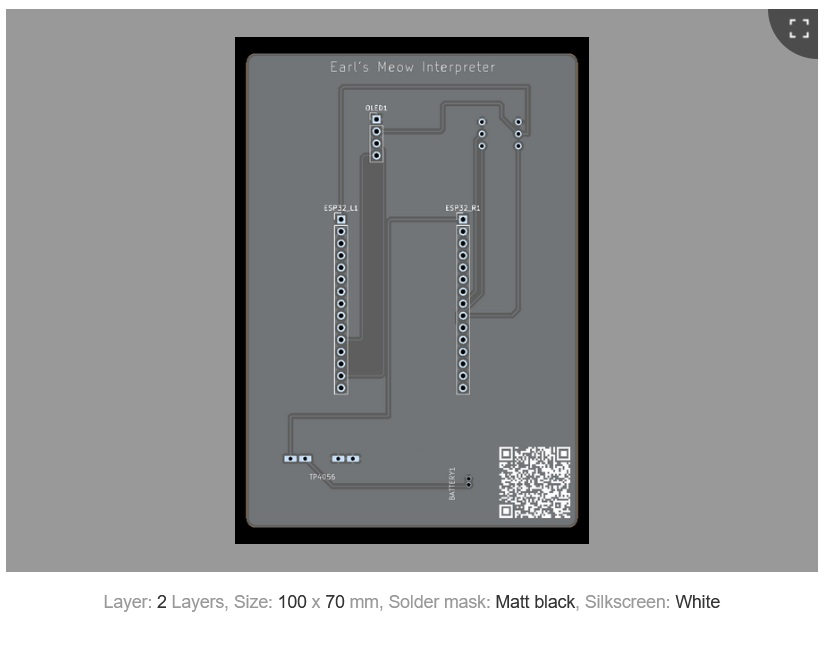
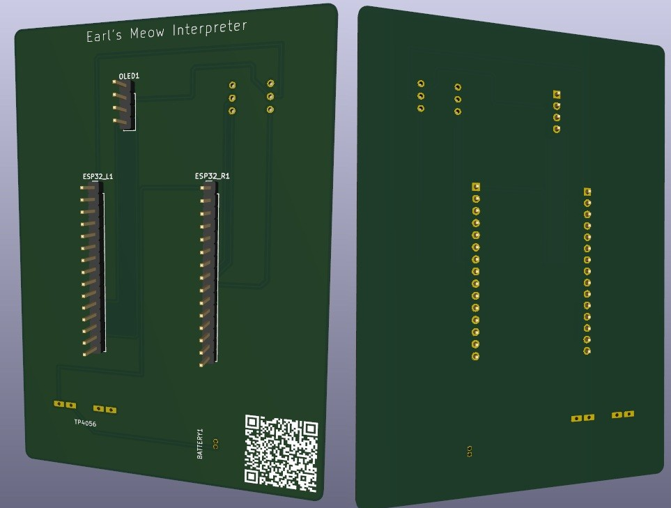

# earls-meow-interpreter
A custom PCB + AI-powered device that listens to my cat Earl Gray's meows and interprets what he's saying
# 🐱🎤 Earl's Meow Interpreter

Earl Gray is a 13-year-old cat with opinions. This device captures Earl's vocalizations using a MEMS microphone, processes the audio on an ESP32, and uses a machine learning model using AWS SageMaker to classify his meows into categories like "hungry", happy", "need attention". 

---

## How It Works

1. **INMP441 MEMS mic** captures Earl's meows
2. **ESP32** processes audio via I2S and sends it to the cloud
3. **AWS SageMaker** runs an audio classification model on the meow data
4. **SSD1306 OLED display** shows the interpreted mood in real time

---

## Hardware

### Parts List

| Component | Description | Interface |
|-----------|-------------|-----------|
| ESP32-WROOM-32 DevKit | 30-pin development board (USBC) | — |
| INMP441 | MEMS I2S digital microphone breakout | I2S |
| SSD1306 OLED | 0.96" I2C display (128x64) | I2C |
| TP4056 | USB-C LiPo charger module | — |
| 3.7V 1200mAh LiPo | Rechargeable battery (JST PH 2-pin) | — |

### GPIO Pin Mapping

| Function | GPIO | ESP32 Pin | Component |
|----------|------|-----------|-----------|
| I2S Serial Data (SD) | GPIO32 | D32 | INMP441 Pin 3 |
| I2S Word Select (WS) | GPIO25 | D25 | INMP441 Pin 4 |
| I2S Clock (SCK) | GPIO33 | D33 | INMP441 Pin 5 |
| I2C SDA | GPIO21 | D21 | OLED Pin 4 |
| I2C SCL | GPIO22 | D22 | OLED Pin 3 |
| Power In (VIN) | VIN | VIN | TP4056 OUT+ |

### Power Architecture

```
LiPo Battery (3.7V) → TP4056 Charger → ESP32 VIN → 3.3V Regulator (onboard)
                                                      ├── OLED (3.3V)
                                                      └── INMP441 (3.3V)
```

### Schematic & PCB

The carrier board connects all breakout modules via pin headers — no bare-chip soldering required. Designed in **KiCad 10**.

| | |
|---|---|
| **PCB Layout** |
|  |

| | |
|---|---|
| **3D View** |
|  |


---

## Software (Coming Soon)

- [ ] ESP32 I2S audio capture firmware (Arduino)
- [ ] Audio preprocessing and feature extraction
- [ ] AWS SageMaker audio classification model
- [ ] Real-time OLED display of classified meow
- [ ] WiFi-based cloud inference pipeline

---

## Project Roadmap

| Phase | Status |
|-------|--------|
| V1 Schematic Design | ✅ Complete |
| V1 PCB Layout | ✅ Complete |
| V1 PCB Fabrication | 🔄 Ordered |
| ESP32 Firmware | ⬜ Upcoming |
| ML Model Training | ⬜ Upcoming |

---

## The Story

Earl Gray has been my co-pilot through a career transition from airline captain to cloud architecture. He's 13, has strong opinions and deserves to be understood. This project combines my love for IoT, cloud computing, and Earl into something that's both technically challenging and fun!

This is also a learning journey — my first custom PCB, my first KiCad project, and my first hardware ML pipeline.

---

## Acknowledgments

PCBs for this project are proudly fabricated by **[PCBWay](https://www.pcbway.com)**. Great quality, fast turnaround, and excellent support for makers and independent hardware projects.

[](https://www.pcbway.com)

*Built with love for Earl Gray* 🐱
